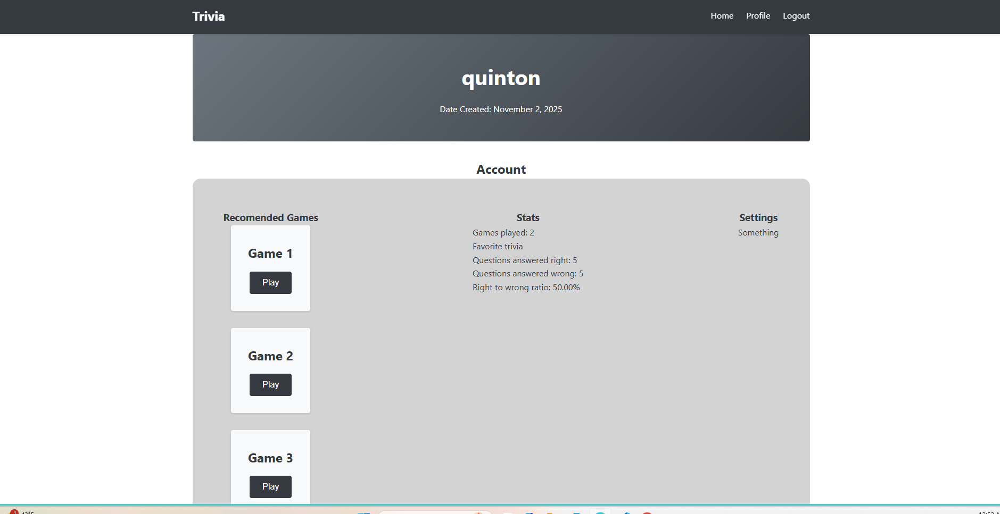
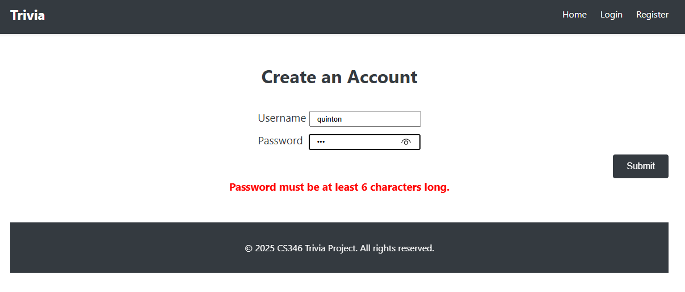
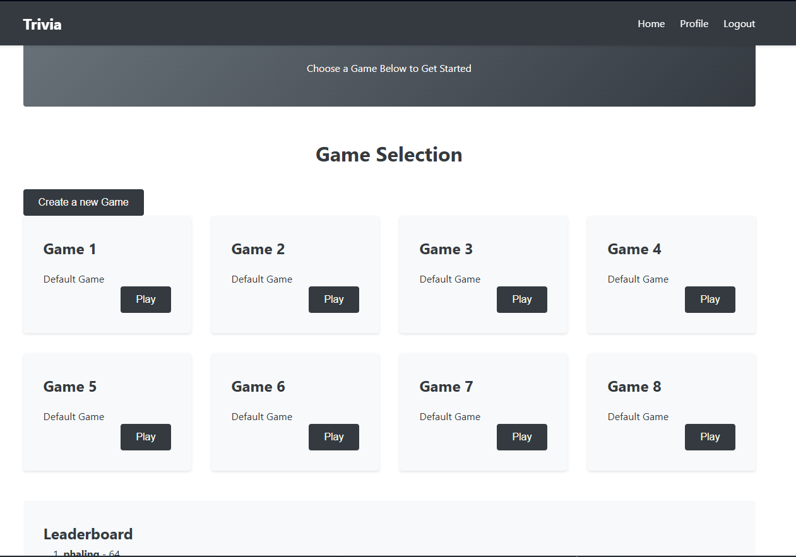

# CS346 Project Template Documentation

## Overview

This is a teaching template for building web applications with:
- **Node.js 20**: JavaScript runtime
- **Express 4**: Web application framework
- **EJS**: Templating engine
- **PostgreSQL**: Relational database
- **Vanilla JavaScript**: Client-side scripting (no frameworks)

## Security Features

- **Helmet**: Sets security-related HTTP headers
- **express-session**: Secure session management
- **CSRF Protection**: Cross-Site Request Forgery protection
- **Parameterized SQL Queries**: SQL injection prevention

## Project Structure

```
.
├── src/
│   ├── server.js           # Server entry point
│   ├── app.js              # Express app configuration
│   ├── routes/             # Route definitions
│   │   ├── index.js        # Main routes
│   │   └── users.js        # User routes
│   ├── controllers/        # Request handlers
│   │   ├── indexController.js
│   │   └── userController.js
│   ├── models/             # Database models
│   │   ├── db.js           # Database connection
│   │   └── User.js         # User model
│   ├── views/              # EJS templates
│   │   ├── index.ejs       # Home page
│   │   ├── error.ejs       # Error page
│   │   └── layout.ejs      # Layout template (optional)
│   └── public/             # Static files
│       ├── css/
│       │   └── style.css   # Stylesheet
│       └── js/
│           └── main.js     # Client-side JavaScript
├── db/
│   ├── migrate.js          # Migration runner
│   ├── seed.js             # Seed runner
│   ├── reset.js            # Database reset script
│   ├── migrations/         # Database migrations
│   │   └── 001_create_users_table.sql
│   └── seeds/              # Database seeds
│       └── 001_seed_users.sql
├── docs/                   # Documentation
│   ├── README.md           # This file
│   ├── SETUP.md            # Setup instructions
│   └── ARCHITECTURE.md     # Architecture overview
├── .env.example            # Environment variables template
├── .eslintrc.json          # ESLint configuration
├── .prettierrc.json        # Prettier configuration
├── .gitignore              # Git ignore rules
├── package.json            # Project dependencies and scripts
└── README.md               # Project README
```

## Getting Started

See [SETUP.md](./SETUP.md) for detailed setup instructions.

## Architecture

See [ARCHITECTURE.md](./ARCHITECTURE.md) for detailed architecture information.

## Development

Week 9 -> Added working login and register forms that save user data as session variables, and are lost on refresh or logout. We also added very basic statistics in the profile page, such as games played, win/loss ratio, etc. Favorite category will be implemented soon. Updated UI improvements include these profile, added registration errors, and a fixed gameover stats page.





Week 11 -> Updated app to direct a user to the login page when not logged in. Implemented login and registration using a databse and password encryption for security with basic password and email checks, as well as adding a password strength meter. Express session persistence and logout features are unchanged from previous versions.

Week 12 -> If no questions are currently stored in the database, the app uses an API to auto-populate 8 games with 6 questions each into the database. These questions are all of random difficulty and category. No API/.env setup is required other than what is needed to connect to the Supabase DB. The leaderboard on the homepage is now functional because of the new user scores table. Note, the code to make the new table is found in the schema.sql file. Previously existing users are out of date, and new ones will be needed to use this new version of the app. The profile page now includes links to the top 3 games that a user has played, and lists what they're most played game is, among other stats. This also requires a new table, and the code for that is also available in the schema.sql file.

The games created by the API are stored as default games due to the random nature of the questions, as seen in the screenshot below.



### Available Scripts

- `npm start`: Start the production server
- `npm run dev`: Start the development server with auto-reload
- `npm run migrate`: Run database migrations
- `npm run seed`: Seed the database with sample data
- `npm run reset`: Reset the database (drop all tables and re-run migrations and seeds)
- `npm run lint`: Check code for linting errors
- `npm run lint:fix`: Fix linting errors automatically
- `npm run format`: Format code with Prettier

### Code Style

This project uses:
- **ESLint** for JavaScript linting
- **Prettier** for code formatting

Run `npm run lint` to check for issues and `npm run format` to format your code.

## Security Best Practices

1. **Environment Variables**: Never commit `.env` file. Use `.env.example` as a template.
2. **Password Hashing**: Always hash passwords using bcrypt before storing.
3. **Input Validation**: Validate and sanitize all user input.
4. **SQL Injection**: Use parameterized queries ($1, $2, etc.) for all database operations.
5. **CSRF Protection**: Include CSRF tokens in all forms.
6. **Session Security**: Use secure, httpOnly cookies in production.

## Database Operations

### Migrations

Migrations are SQL files in `db/migrations/` that create or modify database tables.

To create a new migration:
1. Create a new file: `db/migrations/00X_description.sql`
2. Write your SQL (CREATE TABLE, ALTER TABLE, etc.)
3. Run `npm run migrate`

### Seeds

Seeds are SQL files in `db/seeds/` that populate the database with initial or test data.

To create a new seed:
1. Create a new file: `db/seeds/00X_description.sql`
2. Write your INSERT statements
3. Run `npm run seed`

### Parameterized Queries

Always use parameterized queries to prevent SQL injection:

```javascript
// ❌ Bad (SQL injection vulnerable)
const result = await db.query(`SELECT * FROM users WHERE email = '${email}'`);

// ✅ Good (parameterized)
const result = await db.query('SELECT * FROM users WHERE email = $1', [email]);
```

## Contributing

When contributing to this project:
1. Follow the existing code style
2. Run `npm run lint` before committing
3. Test your changes thoroughly
4. Update documentation as needed

## Resources

- [Express.js Documentation](https://expressjs.com/)
- [EJS Documentation](https://ejs.co/)
- [PostgreSQL Documentation](https://www.postgresql.org/docs/)
- [Node.js Documentation](https://nodejs.org/docs/)
- [Helmet Documentation](https://helmetjs.github.io/)
